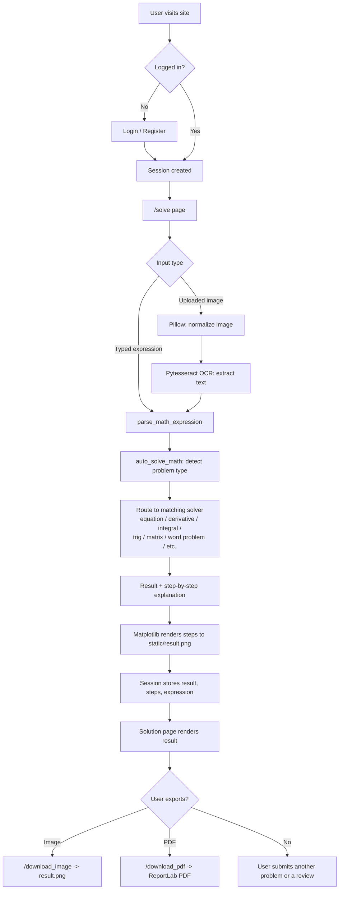

# 🧮 Math Solver AI

An intelligent, Flask-based mathematics assistant that solves algebra, calculus, trigonometry, matrix, statistics, and word problems — with handwritten equation recognition (OCR), step-by-step solutions, auto-generated solution images, and downloadable PDF reports.

---

## 📌 Overview

Math Solver AI is a web application built with **Flask** and **SymPy** that parses a typed or handwritten mathematical expression, detects what *kind* of problem it is, and returns a full step-by-step solution. Results can be exported as a solution image or a formatted PDF report, and users can leave feedback through a built-in review system.

---

## ✨ Key Features

### 🔢 Automatic Problem-Type Detection

A single input box handles many categories of math. The solver inspects the expression and routes it to a dedicated handler:

| Category | Examples it understands |
|---|---|
| Equations & systems | `x**2 - 9 = 0`, `{x + y = 5, x - y = 1}` |
| Inequalities | `2*x + 3 > 7`, `x <= 5` |
| Polynomials | `factor(x**2 - 4)`, `expand((x+1)**2)` |
| Derivatives | `diff(x**3)`, `derivative of sin(x)` |
| Integrals | `integrate(sin(x))` |
| Limits | `limit of 1/x as x -> 0` |
| Logarithms | `log(x)`, `ln(e**2)` |
| Trigonometry & identities | `sin(x)`, trig identity proofs |
| Matrix operations | determinant, inverse, eigenvalues |
| Series & sequences | sums, factorials, sequences |
| Complex numbers | real/imaginary operations |
| Statistics | mean, median, mode, variance, standard deviation |
| Triangle identity proofs | `"show that sin((B+C)/2) = cos(A/2)"` |
| Word problems | area, perimeter, volume, distance, percentage |

Each handler returns both a final **result** and a fully worked **step-by-step explanation**.

### 📝 Handwritten & Printed Equation Recognition (OCR)

Upload an image (`.png`, `.jpg`, `.jpeg`, `.bmp`, `.gif`, `.tiff`) instead of typing:

* Image is normalized (transparency/RGBA handled) with Pillow
* Text is extracted with **Pytesseract**
* Extracted text is fed straight into the same solver pipeline

### 📈 Solution Image Generation

Every solved problem is rendered into a shareable image via **Matplotlib**, containing the steps and final result, saved to `static/result.png` and available as a direct download.

### 📄 PDF Report Generation

Generates a downloadable PDF (via **ReportLab**) containing:

* The original problem
* The computed result
* The full step-by-step explanation

Useful for assignments, lab submissions, and academic records.

### 🔐 Session-Based Authentication

* Login and registration
* Flask session management with a 30-minute session lifetime
* Protected `/solve` route (redirects to login if not authenticated)
* Logout clears the session

> ⚠️ Accounts are currently stored in an in-memory Python dictionary for demo purposes — see [Known Limitations](#-known-limitations-roadmap).

### 💬 Review & Feedback System

Visitors can submit a name, comment, and rating, which are displayed on a public reviews page (in-memory storage).

### 🎨 Multi-Page Responsive UI

Built with HTML5, CSS3, and Jinja2 templates:

* Login / Register
* Solver (home) page with text + image input
* Solution / results page
* FAQ
* About
* Reviews (submit + display)

---

## 🏗️ Project Structure

```text
maths_solver_ai/
│
├── app.py                     # Flask app: routes, solver engine, OCR, PDF/image export
├── requirements.txt           # Python dependencies
│
├── static/
│   ├── style.css              # Global styles
│   ├── features.css           # Feature/solver page styles
│   ├── solution.css           # Solution page styles
│   ├── result.png             # Auto-generated solution image (created at runtime)
│   └── ...                    # Other UI assets (icons, avatars, etc.)
│
├── templates/
│   ├── login.html             # Login page
│   ├── register.html          # Registration page
│   ├── index.html             # Main solver interface (text + image input)
│   ├── solve.html             # Solver page variant
│   ├── solution.html          # Detailed solution/result view
│   ├── home.html              # Landing/home page
│   ├── about.html             # About page
│   ├── faq.html                # FAQ page
│   ├── review.html            # Submit a review
│   └── reviews_display.html   # Display submitted reviews
│
└── uploads/                   # (optional) storage for uploaded equation images
```

---

## 🚀 Installation

### 1. Clone the repository

```bash
git clone https://github.com/ragavarshini3/Ai_Powered_MathSolver.git
cd Ai_Powered_MathSolver
```

### 2. Create a virtual environment

**Windows**
```bash
python -m venv venv
venv\Scripts\activate
```

**Linux / macOS**
```bash
python -m venv venv
source venv/bin/activate
```

### 3. Install dependencies

```bash
pip install -r requirements.txt
```

### 4. Install Tesseract OCR (required for image-based equation recognition)

The OCR feature depends on the **Tesseract OCR engine**, which is a separate system install, not a pip package.

* **Windows:** download and install from the [UB-Mannheim Tesseract build](https://github.com/UB-Mannheim/tesseract/wiki), then update the path in `app.py`:
  ```python
  pytesseract.pytesseract.tesseract_cmd = r"C:\Program Files\Tesseract-OCR\tesseract.exe"
  ```
* **macOS:** `brew install tesseract`
* **Linux (Debian/Ubuntu):** `sudo apt install tesseract-ocr`

> On macOS/Linux, remove or update the hardcoded Windows path in `app.py` so Pytesseract can find the binary on `PATH`.

### 5. Run the application

```bash
python app.py
```

Open your browser at:

```text
http://127.0.0.1:5000
```

---

## 🛠️ Technology Stack

**Backend**
* Flask 3.x
* SymPy (symbolic math engine)
* NumPy
* Matplotlib (solution image rendering)
* Pytesseract + Pillow (OCR)
* ReportLab (PDF generation)

**Frontend**
* HTML5, CSS3
* Jinja2 templates

---

## 📖 Usage Guide

1. **Register / Log in** to access the solver.
2. **Type an expression**, for example:
   ```text
   x**2 + 5*x + 6 = 0
   diff(x**3)
   integrate(sin(x))
   solve {x + y = 5, x - y = 1}
   find the area of a circle with radius 7
   ```
   — or —
3. **Upload an image** of a handwritten/printed equation instead of typing it.
4. **View the result**: the app shows the final answer and a full step-by-step breakdown.
5. **Download** the solution as an image (`/download_image`) or a PDF report (`/download_pdf`).
6. Optionally, leave a **review** or check the **FAQ / About** pages.

---

## 🔌 Application Routes

| Route | Method(s) | Purpose |
|---|---|---|
| `/` | GET | Redirects to login |
| `/login` | GET, POST | User login |
| `/register` | GET, POST | New user registration |
| `/logout` | GET | Clears session |
| `/solve` | GET, POST | Main solver (text input + image upload) |
| `/download_image` | GET | Downloads the generated solution image |
| `/download_pdf` | GET | Downloads a PDF report of the current solution |
| `/faq` | GET | FAQ page |
| `/about` | GET | About page |
| `/review` | GET | Review submission form |
| `/submit_review` | POST | Stores a submitted review |
| `/reviews` | GET | Displays all submitted reviews |

---

## 🔄 Application Workflow

This is what happens end-to-end when a user submits a problem, from login to downloadable output.



### Step-by-step breakdown

1. **Authentication** – The user logs in or registers. Flask creates a session (`session['user']`), valid for 30 minutes, protecting the `/solve` route from anonymous access.
2. **Input capture** – On the solver page, the user either types an expression or uploads an image of a handwritten/printed equation.
3. **OCR (if an image was uploaded)** – Pillow normalizes the image (handles RGBA/transparency), then Pytesseract extracts the text, which is treated exactly like a typed expression from this point on.
4. **Expression parsing** – `parse_math_expression()` normalizes notation (`^` → `**`, `×`, `÷`, `√`, etc.) and parses it into a SymPy expression, with implicit multiplication support.
5. **Problem-type detection** – `auto_solve_math()` inspects keywords and structure (e.g. presence of `=`, `<`, `diff`, `integrate`, `matrix`, `sin`/`cos`) to decide which specialized solver should handle the request.
6. **Solving** – The matched handler (equation, derivative, integral, limit, log, trig, matrix, series, complex, statistics, triangle-identity proof, or word problem) computes the result and builds a detailed, human-readable step-by-step explanation.
7. **Visualization** – Matplotlib renders the steps and result into an image, saved to `static/result.png`.
8. **Session persistence** – The result, steps, and original expression are stored in the session so they persist across the solution page and export routes.
9. **Rendering** – The solution page displays the final answer and full working.
10. **Export (optional)** – The user can download the solution as a PNG (`/download_image`) or a formatted PDF report (`/download_pdf`, built with ReportLab).
11. **Feedback loop (optional)** – The user can leave a rating/comment via `/submit_review`, viewable by everyone on `/reviews`.

---

## ⚠️ Known Limitations / Roadmap

These are worth addressing before any production deployment:

* **User store is in-memory** (`users = {...}` in `app.py`) — accounts and passwords are lost on restart and are **not hashed**. Replace with a real database (SQLite/PostgreSQL) and password hashing (e.g. `werkzeug.security`) before real-world use.
* **Reviews are in-memory** as well — they reset every time the server restarts.
* **Hardcoded Tesseract path** points to a Windows install location by default; update per OS as described in installation.
* **`debug=True`** should be turned off in any production deployment.

### Planned Enhancements
* Persistent database for users, history, and reviews
* Password hashing and stronger auth
* LaTeX rendering for input/output
* Interactive function graph plotting
* REST API mode
* Cloud deployment configuration

---

## 💡 Use Cases

* Mathematics learning and self-study
* Homework and assignment assistance
* Engineering and academic calculations
* Mini/major academic projects and demonstrations

---

## 👩‍💻 Author

**Ragavarshini Alagarsamy**

* GitHub: [ragavarshini3](https://github.com/ragavarshini3)
* LinkedIn: [ragavarshini-alagarsamy](https://www.linkedin.com/in/ragavarshini-alagarsamy-17mar2006)

---

## ⭐ Support

If you found this project useful:

⭐ Star the repository · 🍴 Fork the project · 🛠️ Contribute improvements

---

*"Making Mathematics Smarter with AI"*
